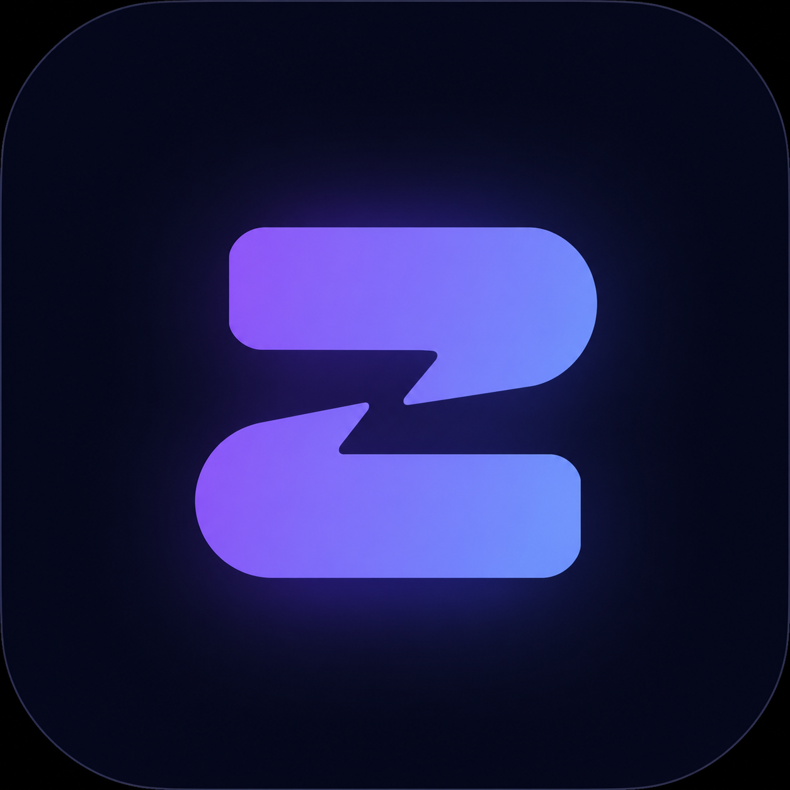
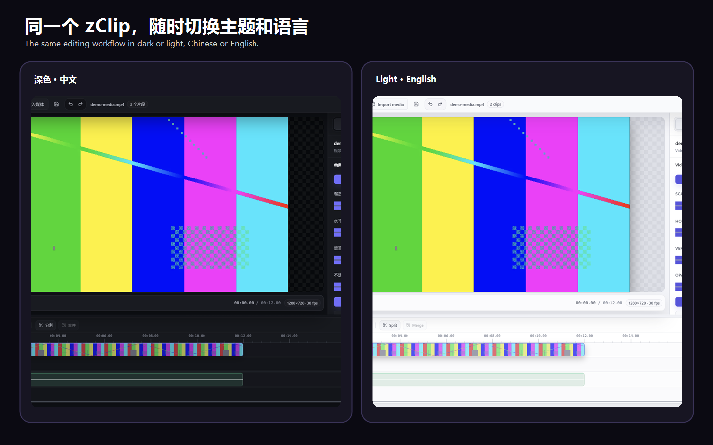
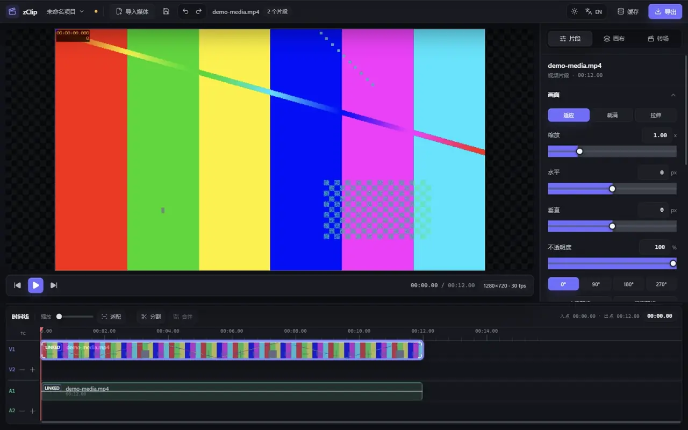

<p align="center">
  <strong>简体中文</strong> · <a href="./README.en.md">English</a>
</p>

<p align="center">
  <a href="https://github.com/zJay26/zClip/releases/latest">
    
  </a>
</p>

<h1 align="center">zClip</h1>

<p align="center"><em>A local-first, offline Windows video editor without subscriptions.</em></p>
<p align="center"><strong>偶尔只想剪一段视频，不必启动一整套专业软件，也不该在导出时才撞上会员墙。</strong></p>
<p align="center">zClip 是一款面向 Windows 的免费开源本地视频剪辑器：素材不上传，常用剪辑和导出在自己的电脑上完成。</p>

<p align="center">
  <a href="https://github.com/zJay26/zClip/releases/latest"></a>
  <a href="https://github.com/zJay26/zClip/releases"></a>
  <a href="https://github.com/zJay26/zClip/actions/workflows/ci.yml"></a>
  <a href="./LICENSE"></a>
</p>

<p align="center">
  <a href="https://github.com/zJay26/zClip/releases/download/v2.5.1/zClip.Setup.2.5.1.exe"><strong>下载 Windows 安装包</strong></a>
  ·
  <a href="#先看效果">先看效果</a>
  ·
  <a href="#三步开始剪辑">三步上手</a>
</p>

> [!WARNING]
> `v2.5.1` 的 Windows 安装包尚未进行商业代码签名，Windows 可能显示“未知发布者”或 SmartScreen 提示。请只从本仓库 Releases 下载，并用同一页面的 `SHA256SUMS.txt` 核对文件；详情见[首次运行说明](#windows-首次运行提示)。

## zClip 解决什么麻烦

- **小需求不想上重工具：** 剪掉开头结尾、拼几个片段、加一段音乐，不值得先等大型专业软件启动和建工程。
- **不想被导出卡住：** zClip 没有登录、VIP 清晰度或导出次数限制，安装后就能使用完整功能。
- **不想上传素材：** 媒体解析、预览和导出都在本机完成，私人录像和工作素材不必交给在线服务。
- **不想先学一门课：** 导入素材、拖到时间线、剪好后导出，常用流程尽量保持短而直接。

## 适合谁

- 偶尔要处理课程、会议、录屏、游戏片段或社交媒体素材的 Windows 用户
- 希望快速裁剪、拼接、调音量或转成常见格式的内容创作者
- 在意隐私，希望素材留在本机的人
- 想研究或二次开发一个完整 Electron + FFmpeg 桌面项目的开发者

## 先看效果



<details>
<summary>查看导入、剪辑与导出的短演示</summary>

<p align="center">
  
</p>

</details>

## 下载

当前版本：`2.5.1`，支持 Windows 10/11 x64。

<p align="center">
  <a href="https://github.com/zJay26/zClip/releases/download/v2.5.1/zClip.Setup.2.5.1.exe">
    
  </a>
</p>

- [查看本版本说明](https://github.com/zJay26/zClip/releases/tag/v2.5.1)
- [下载 SHA-256 校验和](https://github.com/zJay26/zClip/releases/download/v2.5.1/SHA256SUMS.txt)
- [查看签名状态](https://github.com/zJay26/zClip/releases/download/v2.5.1/SIGNING_STATUS.txt)

## 三步开始剪辑

1. 打开 zClip，把视频或音频拖进窗口，也可以点击“打开文件”。
2. 在时间线上分割、移动、裁剪片段，按需要调整画面、速度、音量、音调或转场。
3. 点击右上角“导出”，选择格式和清晰度，等待本机处理完成。

项目可保存为 `.zclip` 文件；下次双击即可继续。自动保存、最近项目恢复和素材丢失后的重新定位也已内置。

## 能做什么

- 同时导入多个视频和音频，使用多轨时间线组合内容
- 分割、复制、剪切、粘贴、删除、撤销与重做
- 调整画布尺寸、背景、FPS，以及片段位置、缩放和旋转
- 调整裁剪范围、速度、音量、音调和淡入淡出
- 使用七种转场，并直接在预览画面中拖动定位
- 导出整条时间线、选中片段或自定义范围，显示进度、速度与预计剩余时间

### v2.5.1 有什么新变化

- 时间轴片段跨轨拖动更流畅，选中反馈更醒目
- 修复时间轴与功能区争夺键盘焦点，空格播放和 Delete 删除更可靠
- `LINKED` / `UNLINKED` 状态与实际链接关系一致，并可正常取消链接
- 纯音频时间线播放到结尾后会自动暂停并复位播放按钮
- 应用、安装包和文档统一使用新的 zClip 图标

## 它不打算替代什么

zClip 适合日常快速剪辑，但暂时不以专业调色、复杂合成、多机位协作、插件生态或跨平台制作为目标。如果你的工作依赖这些能力，Premiere Pro、DaVinci Resolve 等专业 NLE 会更合适。

## 支持的导出格式

- 视频与动图：`mp4`、`mov`、`mkv`、`webm`、`gif`、`webp`
- 音频：`mp3`、`wav`、`flac`、`aac`、`opus`
- 分辨率：原始、1080p、720p、480p
- 质量：超高、高、中、低、超低与自定义

## Windows 首次运行提示

当前安装包没有 Authenticode 商业签名，因此浏览器或 Windows SmartScreen 可能提示风险：

1. 确认文件来自 `github.com/zJay26/zClip` 的 Releases 页面。
2. 用 `SHA256SUMS.txt` 核对安装包 SHA-256。
3. 若 SmartScreen 拦截，点击“更多信息”，确认应用名为 zClip 后选择“仍要运行”。

未签名并不等于检测到恶意代码，但会降低 Windows 对发布者身份的信任。仓库会公开安装包校验和、签名状态、第三方声明和 SBOM，方便自行核验。

## 常见问题

<details>
<summary>需要联网或登录吗？</summary>

不需要。剪辑与导出均在本机完成，也没有账户系统。下载应用和获取更新时需要访问 GitHub。

</details>

<details>
<summary>为什么第一次运行会看到 Windows 警告？</summary>

因为当前安装包尚未购买商业代码签名证书。请从官方 Release 下载并核对 SHA-256；签名状态会随每个版本一起发布。

</details>

<details>
<summary>旧的 .zclip 项目还能打开吗？</summary>

可以。项目 schema 仍为 v1；旧项目缺少 FPS 设置时会按 30 FPS 打开。

</details>

<details>
<summary>可以在 macOS 或 Linux 上运行吗？</summary>

当前正式支持范围只有 Windows 10/11 x64，其他平台尚未提供经过验证的安装包。

</details>

## 快捷键

<details>
<summary>展开快捷键表</summary>

| 操作 | 快捷键 |
| --- | --- |
| 新建项目 | `Ctrl/Cmd + N` |
| 打开项目 | `Ctrl/Cmd + O` |
| 保存 / 另存为 | `Ctrl/Cmd + S` / `Ctrl/Cmd + Shift + S` |
| 播放 / 暂停 | `Space` 或 `K` |
| 后退 / 前进 5 秒 | `J` / `L` |
| 前后单帧 | `←` / `→` |
| 前后 1 秒 | `Shift + ←` / `Shift + →` |
| 在播放头处分割 | `C` |
| 复制 / 剪切 / 粘贴 | `Ctrl/Cmd + C` / `X` / `V` |
| 删除 | `Backspace` 或 `Delete` |
| 撤销 / 重做 | `Ctrl/Cmd + Z` / `Ctrl/Cmd + Y` |

</details>

## 给开发者

### 环境要求

- Node.js 22.12+
- npm 10+
- Windows 10/11 x64

```bash
npm install
npm run dev
```

常用验证命令：

```bash
npm run check
npm run pack:dir
npm run check:packaged
```

技术栈为 Electron、React、TypeScript、Zustand、Tailwind CSS 与固定哈希的 FFmpeg/FFprobe 8.1.2。更深入的信任边界与媒体流水线见[架构说明](./docs/architecture.md)。

## 参与项目

- 有 Bug：使用 [Bug report](https://github.com/zJay26/zClip/issues/new/choose)
- 有想法：前往 [Discussions](https://github.com/zJay26/zClip/discussions) 或提交 Feature request
- 想贡献代码：先阅读 [CONTRIBUTING.md](./CONTRIBUTING.md)
- 发现安全问题：不要公开发 Issue，请阅读 [SECURITY.md](./SECURITY.md)
- 想了解方向：查看 [ROADMAP.md](./ROADMAP.md)

如果 zClip 确实帮你省下了时间，欢迎点一个 Star。它会让更多有同样小剪辑需求的人更容易发现这个项目。

## License

[MIT](./LICENSE) © zJay26
